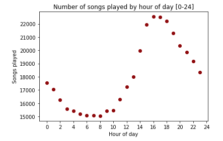

# Sparkify - Churn prediction using Spark



The following project tries to predict user churn rate in a fictitious music streaming service called Sparkify.

I used Spark in Amazon Web Services (**AWS**) with an Elastic Map Reduce (**EMR**) cluster of 3 **m5.xlarge machines**. One driver and two workers. The dataset size is 12 Gbytes and was read from an AWS Simple Storage Service (S3) bucket in JSON format. This file contains activity registered from users as they used the service daily.

As software libraries go I have used: PySpark, Python's Spark API. AWS EMR version 5.29.0. Logistic Regression, Random Forest, Gradient Boost Trees (GBT) Classifier, and Naive Bayes form Spark's Machine Learning Library. Pandas and Matplotlib from the standard data science Python stack.

## AWS EMR cluster

To run the project in AWS EMR the following steps need to be performed to improve performance.

When you are creating the EMR cluster in the AWS console remember to choose *advanced options*. Make sure that **Spark* and *Livy* are included as applications.

Under *Enter Configuration* add this:

```json
[
    {
    "Classification": "livy-conf",
    "Properties": {
        "livy.server.session.timeout":"10h"
        }
    }
]
```

This sets up a timeout value for the Jupyter Notebook of 10 hours. Maybe excessive but the default is just 1 hour, which is low to train several models and perform grid search.

Not required but good to verify later that the Livy timeout is changed to the value we want is making sure to create the EMR cluster with a known ec2 key-pair login in from terminal to the master node and verify the parameter is set up in `/etc/livy/conf/livy.conf`

Once the cluster is ready ad the following as a configuration setting for all EC2 groups:

```json
[
    {
    "classification" : "spark",
    "properties" : {
        "maximizeResourceAllocation" : "true"
        },
    "configurations" : []
    }
]
```

Also, you need to upload the `medium-sparkify-event-data.json` file to an S3 bucket accessible from the EMR cluster.

The blog post with the analysis and results of this work is [here](https://medium.com/p/d9c2da720bc8/edit)
